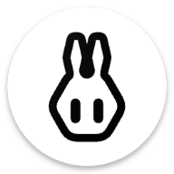

<div align="center">
  
  <h1>RikkaHub for Windows</h1>
  <p><b>RikkaHub Android → Windows 10+ 原生移植版</b></p>
  <p>
    <a href="https://github.com/alzatry1/rikkahub-windows/actions/workflows/build.yml"></a>
    
    
    
    
  </p>
</div>

> [RikkaHub](https://github.com/rikkahub/rikkahub) 是一个支持多供应商的大模型聊天 Android 客户端。
> 本仓库是它的 **Windows 10/11 原生移植**：使用微软官方 Windows 应用开发框架（**WinUI 3 / Windows App SDK + .NET 8 + C#**，零 Java）完整复刻其功能与 Material You UIUX 风格。

## ✨ 已实现（与 Android 版对应）

| Android (Kotlin/Compose) | Windows (C#/WinUI 3) |
|---|---|
| 多 Provider 聊天 (OpenAI 兼容 / Gemini / Claude) | ✅ SSE 流式，三协议完整移植 |
| 消息 Markdown 渲染（marked.js + KaTeX + Mermaid + highlight.js） | ✅ 复用原版 `mark.html` 渲染管线（WebView2），像素级一致 |
| Material You 动态取色 / 深色模式 | ✅ HCT 色彩空间 (material-color-utilities C#) 1:1 移植 |
| 消息分支 / 重新生成 / 复制 | ✅ |
| 思考过程展示 | ✅ |
| 图片多模态输入 | ✅ |
| 供应商管理（API Key / BaseURL / 获取模型列表） | ✅ |
| 模型管理（显示名 / 能力标记 / Tool / Reasoning / Vision） | ✅ |
| 助手定制 | ✅ |
| 会话历史 / 置顶 / 重命名 / 删除 | ✅ |
| Token 用量统计 | ✅ |
| 中英文界面 | ✅ |
| DataStore 持久化 | ✅ `%LOCALAPPDATA%\RikkaHub`（设置+会话 JSON） |

## 🚀 获取安装包

**云端构建**：本仓库所有编译均在 GitHub Actions（`windows-latest`）上完成，本地不进行任何编译。

1. ⬇️ **直接下载安装包**：[RikkaHub-Setup-x64.exe (v1.0.0)](https://github.com/alzatry1/rikkahub-windows/releases/download/v1.0.0/RikkaHub-Setup-x64.exe)
2. 到 [Releases](https://github.com/alzatry1/rikkahub-windows/releases) 页面获取各版本
3. 或到 [Actions](https://github.com/alzatry1/rikkahub-windows/actions) 下载最新构建产物 `RikkaHub-Windows-x64`

系统要求：Windows 10 2004 (19041) 及以上 / Windows 11，x64。安装包为自包含部署，无需预装 .NET 运行时。

## 🏗️ 工程结构

```
RikkaHub.sln
├── src/RikkaHub.Core            # ai 模块移植：模型 / Provider / SSE 流式 / 持久化
│   ├── Provider/                # ProviderSetting, UIMessage, OpenAI/Gemini/Claude Provider
│   ├── Model/                   # Conversation, Settings, Assistant
│   └── Data/                    # DataStore (设置 + 会话持久化)
└── src/RikkaHub.App             # app 模块移植：WinUI 3 界面
    ├── Pages/                   # ChatPage / History / Setting / Assistant …
    ├── Theme/                   # Material You 主题引擎 (HCT)
    ├── Services/                # AppCtx (状态中枢) / Loc (i18n)
    └── Assets/mark.html         # 原版 Markdown 渲染模板
```

## 🧑‍💻 本地开发

```powershell
dotnet restore
dotnet build -c Release -p:Platform=x64
dotnet publish src/RikkaHub.App -c Release -r win-x64 --self-contained true -o publish
```

需要 Windows 10 SDK (19041+) 与 .NET 8 SDK。

## 📄 许可

AGPL-3.0（与上游 [RikkaHub](https://github.com/rikkahub/rikkahub) 一致）。
